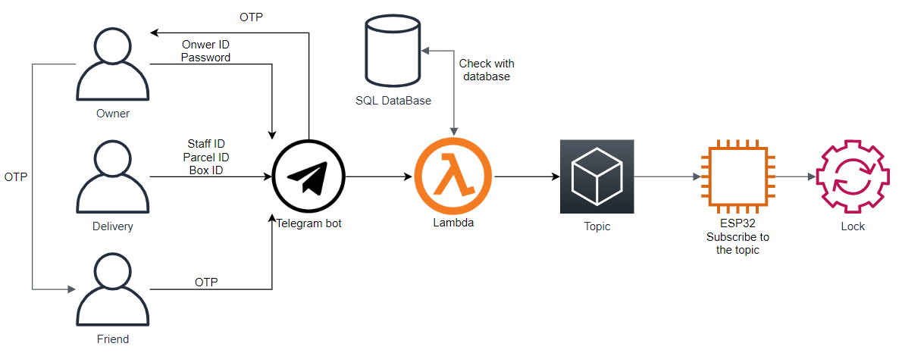
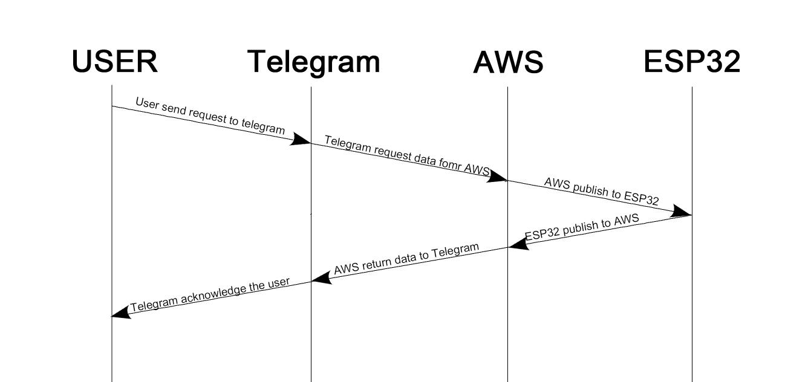
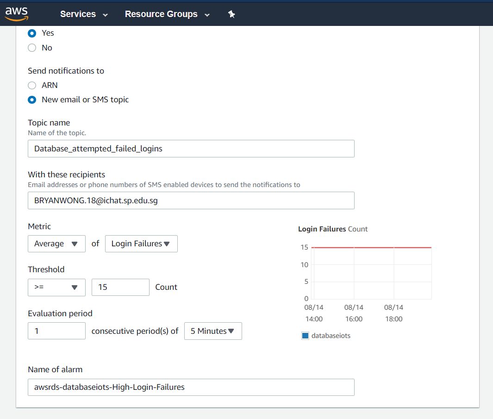
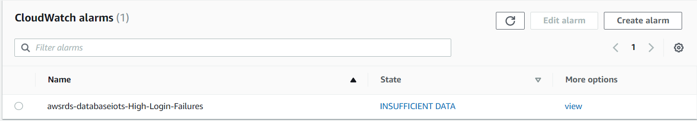
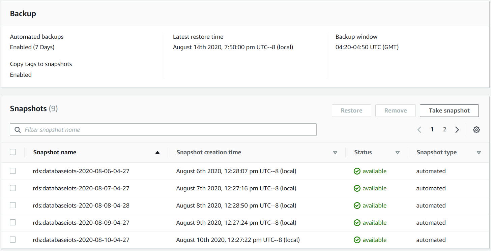
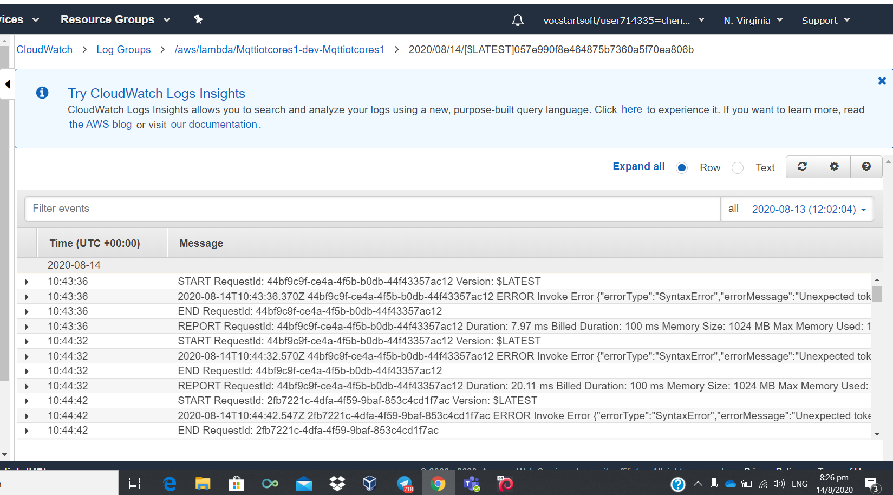

# IOTS ET0731 
# Introduction
During this special period of time, most of us will be in favour of not having close contact with strangers. For students and working adults, we sometimes will encounter times when the parcel arrives and we are unable to present at the point of time.This has caused our parcels to be left at the doorstep or kept in the riser, leaving them at risk of being stolen.

It also leads to a waste of resources and time as the delivery man has to come again another day.How can we allow the delivery man to deliver the parcel to the user safely and easily without it costing too much and downloading an additional app.

IOTS repo for telegram bot hosted on aws lambda controlling a vault locking system
## About The Team
* ***Bryan Wong***
* ***Lim Cheng Ee***
* ***Chen XinHu***
* ***Jia Nan***
## Infrastructure
### User-Service FLow Diagram

The Whole flow of Safe Vault Process:

  * The vault comes with a owner ID and a default Password -> the user/subscriber of service would need to change to the default password
    for stronger user authentication.
  * At each delivery, out collaboration company will update the database with respective delivery ID and Parcel No. to the matching Box ID
  * When the courier reaches the door step, He then will need to key in the Box ID, Parcerl No. along with his staff ID in order to verify himself.
  
### Electronic Components Connection

### Time Diagram

## TelegramBot Commands
 **/Register**
 - Register owner to box by using default password
 - Default password given after owner has paid for the box
 - Owner generates a new password
 - Password is hashed and salted before saved in database

 **/Unregister**

 **/Unlock**
 - Unlocks specifc box using password
 - password is verified with hashed password in database

 **/OTP**
 - Verifies Owner by verifying password and box_id
 - Generates OTP and saves to database
 - Tracks creation time and save to database 

 **/UnlockOTP**
 - Checks OTP of specifc box_id
 - If OTP is valid and time elapse since creation not longer than 30 minutes
 - Sends MQTTS command to unlock box

 **/delivery**
 - Verifies delivery_id, box_id, staff_id of delivery man with Company current deliveries database
 - delivery_id is unique to each parcel delivery
 - staff_id is secret and specifc to specifc delivery staff
 - box_id identifies the box
 - If credentials valid, sends MQTTS command to unlock Box

 **/check**
 - Publishes MQTTS command to specifc box to determine if box has parcels
 - ESP32 publishes reply, saved by lambda to database
 - Telegram queries database to determine if box has parcels
 
### Database Creation + Alarms
Cloudwatch Alarms created to send notification on high number of login failures to database (in the event database enpoint exposed)
Creation:

Alarm:

Database backups for the last 7 days in case of database failure

### Cloudwatch
All input like MQTT are logged , when there is error the admin can use cloudwatch

### IOTcore
Each device has its own publish or subscirbe topic
Uses MQTT protocol
Permission for lambda to use iot core

 TR64 Compliance check
### DREAD risk assessment
|                            | DREAD RISK       |                 |                |                |                |              |
| -------------------------- | ---------------- | --------------- | -------------- | -------------- | -------------- | ------------ |
| Attack                     | Damage Potential | Reproducibility | Exploitability | Affected Users | Discoverablity | Risk (MAX=5) |
| Spoofing                   |                  |                 |                |                |                |              |
| WiFi access                | 3                | 5               | 4              | 2              | 2              | 3.2          |
| Unauth connection (stolen) | 4                | 4               | 1              | 3              | 1              | 2.6          |
| Cloning of hardware        | 2                | 4               | 4              | 2              | 4              | 3.2          |
| Session hijack             | 4                | 1               | 3              | 1              | 3              | 2.4          |
| Physical                   | 2                | 1               | 3              | 1              | 1              | 1.6          |
| RF jamming                 | 4                | 4               | 4              | 2              | 1              | 3            |
| Hardware Error             | 3                | 1               | 1              | 1              | 1              | 1.4          |
| Man in the middle          | 5                | 2               | 4              | 1              | 5              | 3.4          |
| Modified data              | 5                | 2               | 5              | 1              | 4              | 3.4          |
| Door data leak             | 4                | 3               | 4              | 2              | 5              | 3.6          |
| UUID Leak                  | 5                | 1               | 4              | 2              | 5              | 3.4          |
| User ID Leak               | 4                | 1               | 4              | 4              | 3              | 3.2          |
| Flooding                   | 5                | 5               | 4              | 4              | 1              | 3.8          |
| Redirect notification      | 4                | 1               | 3              | 1              | 1              | 2            |
| Botnet inclusion           | 3                | 1               | 2              | 1              | 5              | 2.4          |
| Cryptojacking              | x                | x               | x              | x              | x              | x         |

### TR64 Checklist
| Attack       | Checklist                                                                                                                                   | TR64 Code                                 | Description                                                                                                           			    |
| ------------ | ------------------------------------------------------------------------------------------------------------------------------------------- | ----------------------------------------- | --------------------------------------------------------------------------------------------------------------------- 			    |
| ESP32        | Sturdy and secure Box, ESP32 Certificates for communcations, Lambda/Iot Devices uses unique endpoint and passwords                          | AP-03 AP-04 DP-02 IA-02                   | Enclosure is not easily tampered with. ESP32 uses MQTTS, uses certificates                             								|
| Telegram API | OTP generated for MFA, Clients have unique IDs	                                       											             | IA-02 AP-02	                   			 | OTP generated by bot, clients are uniquely identified, Secure Communications  														|
| AWS system   | Passwords are hashed + salted with verified library. Code prevent SQL injection. AWS RDS database, Secure Communications in Virtual Cloud, database backups and Alarms | IA-01 CS-02 DP-03 NP-01 AU-01					 | Verified library bcrypt used for hashing and salting. Usage of mysql library prevents SQL injection, services are isolated virtual cloud. Alarm on many unsuccessful login attempts to databse

DDos on telegram bot

### Potential Improvements

Possible Improvements | Description/Resoning
-----------|---------------------
Use trusted library to generate OTP | standard open source library is more secure and has been cross examined by professionals.
Password policy | users needs a policy to generate passwords of sufficient strength and mitigate brute-force attacks
DDOS protection/Rate limiting | There is no rate limiting for telegram bot on lambda, DDOS attacks can bring down the usability of Safe Vault
Hashing OTP | Prevent OTP from being used if database leaked
Input validation for telegrambot | Inputs can be checked to ensure utf-8
More secure randomiser | Math.Random() is not cryptographically secure, a more secure library should be used 
Non-repuditation | Safe Vault potentially vulnearble to replay attacks 
3D printer casing | Prevent Physical tampering

### Build Materials

### References
bcrypt
sync-mysql

### Usage
